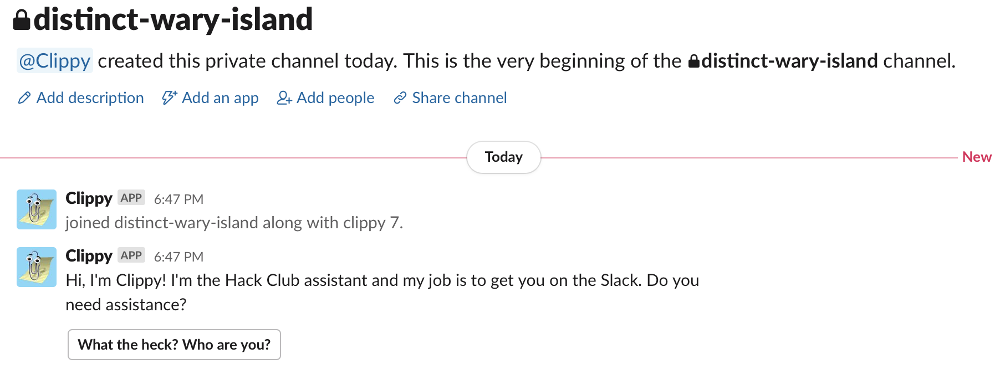

Clippy is a friendly bot that welcomes new members to the Hack Club Slack with a 1-minute interactive introduction to the community.

If you're already a member of the Slack but are interested in going through the new onboarding flow, you can still do so by typing `/restart` anywhere in the Hack Club Slack. Feedback is highly appreciated!

to get started, ask @zfogg or @sampoder to be added to the clippy (dev) app on Slack and ask for a `.env` file
